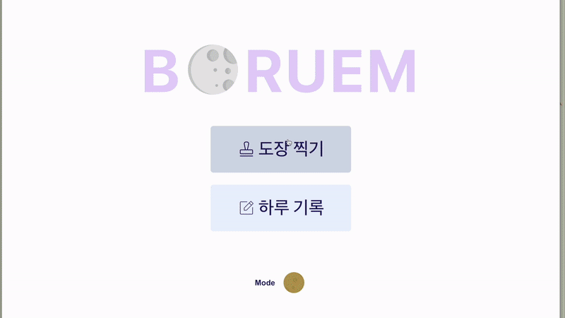
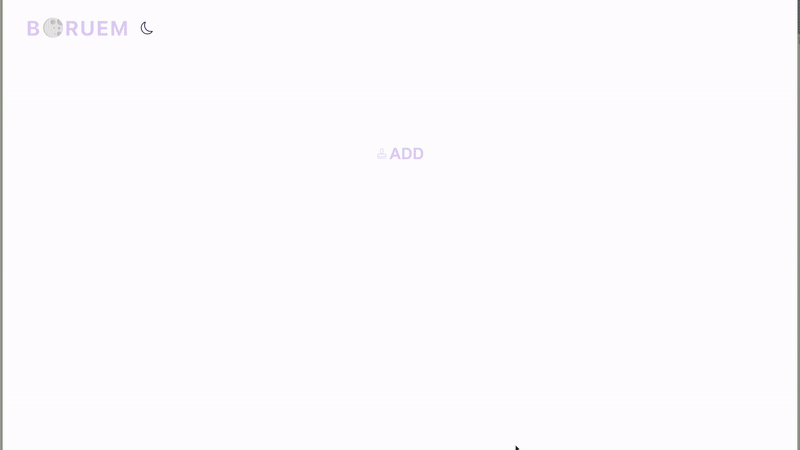

# 🌕 BOREUM

> React+TypeScript 프로젝트
>
> **보름동안** 습관 만들기 프로젝트
>
> 보름 간 사용자의 하루를 기록하여 습관 만들기
>

 

### 배포 사이트 바로가기

# [**BOREUM**](https://boreum.netlify.app/)

 
 

# 메인 화면

> **PC / Tablet 반응형**
>
> **Context Api 활용 다크모드**

 

# 도장 찍기 화면

> **PC / Tablet 반응형**
>
> **Context Api 활용 다크모드**

 

# 하루 기록 화면

> **PC / Tablet 반응형**
>
> **Context Api 활용 다크모드**
>
> **비디오 / 이미지 / 노트 / 투두** 입력

 
